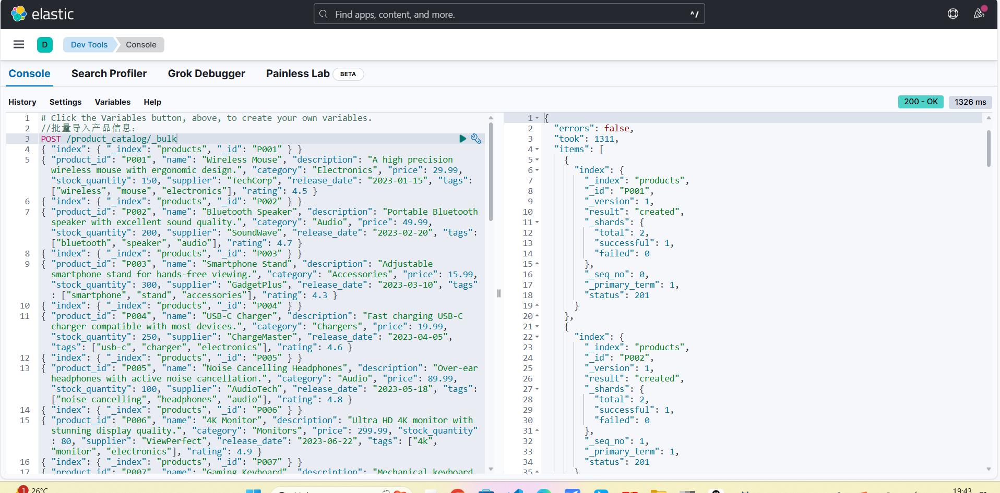

# 实验二 索引&文档操作

**学院：省级示范性软件学院**

**题目：**《 实验二：索引&文档操作》

**姓名：**龚鹏涛

**学号：**2100940082

**班级：**软工2202

**日期：**2024-09-14

**实验环境：** Elasticsearch-8.12.2、kibana-8.12.2

## 一、实验目的

1. 掌握Elasticsearch 安装IK分词器安装方法
2. 掌握Elasticsearch 索引操作方法
3. 掌握Elasticsearch 文档操作训练
4. Elasticsearch 高级查询与DSL训练

## 二、实验内容

### 1. 索引操作练习

任务一：

1. 创建索引
2. 修改索引(自己设计，修改要合理）
3. 删除索引
4. 查看所有

#### 1.1. 用户信息 (User Information) 索引

- 创建User Information索引

  

### 1.2. 产品目录 (Product Catalog) 索引

- 创建Product Catalog索引

### 1.3.订单记录 (Order Records) 索引

- 创建Order Records索引

### 1.4.用户(user_index) 索引

- 创建user_index索引

- 修改user_index索引

- 删除user_index索引

- 查看索引

## 2. 文档操作练习

任务二：

1. 创建文档
2. 修改文档(自己设计，修改要合理）
3. 删除文档
4. 查看文档
5. 将提供的数据批量导入ES数据库中

### 2.1. 创建文档

### 2.2. 修改文档

### 2.3. 删除文档

### 2.4.查看文档

### 2.5.将提供的数据批量导入ES数据库中

- 批量导入用户信息

- 批量导入产品目录数据

- 批量导入订单数据

## 3. 高级查询&DSL练习

任务三：

完成下面的30道练习题

### 3.1. 用户信息数据查询

1. 查询所有女性用户的姓名和电子邮件。

   

2. 查找最后登录日期在2024年9月1日之后的所有活跃用户。

   

3. 查询住在"Anytown"的用户。

   

4. 查找出生日期在1990年之后的所有用户。

   

5. 查询所有状态为"inactive"的用户。

   

6. 查找注册日期在2023年1月1日到2023年12月31日之间的用户。

   

7. 查询名字为"Bob Smith"的用户的详细信息。

   

8. 查找电话号码以"123"开头的用户。

   

9. 查询电子邮件域为"example.com"的所有用户。

   

10. 查找所有名字中包含"Lee"的用户。

    

    ### 3.2. 产品目录数据查询

    1. 查询所有类别为"Audio"的产品名称和价格。

       

    2. 查找价格高于50美元的所有产品。

       

    3. 查询库存数量少于100的产品。

       

    4. 查找评分高于4.5的所有产品。

       

    5. 查询标签中包含"smart"的所有产品。

       

    6. 查找供应商为"TechCorp"的产品。

       

    7. 查询发布日期在2023年6月1日之后的所有产品。

       

    8. 查找描述中包含"wireless"的产品。

       

    9. 查询价格在20美元到100美元之间的所有产品。

       

    10. 查找产品名称中包含"Light"的所有产品。

        

        ### 3.3. 订单记录数据查询

        1. 查询所有状态为"completed"的订单的订单ID和总金额。

           

        2. 查找总金额大于100美元的所有订单。

           

        3. 查询支付方式为"paypal"的订单。

           

        4. 查找订单日期在2024年2月之后的所有订单。

           

        5. 查询包含产品ID为"P001"的订单。

           

        6. 查找所有状态为"cancelled"的订单的客户ID。

           

        7. 查询发货日期在2024年1月15日之前的订单。

           

        8. 查找使用"credit_card"支付的订单。

           

        9. 查询总金额在50美元到200美元之间的所有订单。

           

        10. 查找订单ID中包含"OR01"的所有订单。

            

## 三、问题及解决办法

- 问题:代码有些操作生疏，在查询过程中有些操作不当（例如字母打错，下划线，英转中等问题）导致搜出的结果为null
- 解决办法:在写查询代码的时候注意其准确性，以及逆推回来纠正错误，以及借助一些工具进行学习（例如csdn、chatGpt等）。