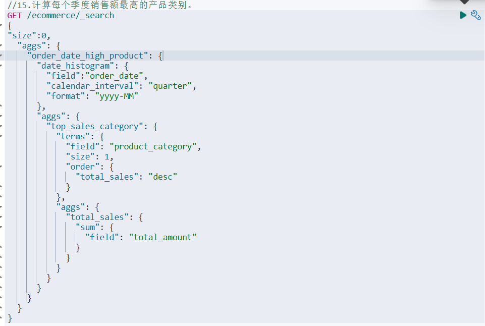

# 《实验三：聚合操作练习》

**学院：省级示范性软件学院**

**课程：高级数据库技术与应用**

**题目：《实验三：聚合操作练习》**

**姓名：龚鹏涛**

**学号：2100940082**

**班级：软工2202**

**日期：2024-10-13**

**实验环境：Elasticsearch8.12.2、 Kibana8.12.2**

## 一、实验目的

**学习并熟练使用Elasticsearch聚合操作**

## 二、实验内容

### 1. 电商数据分析:

#### 1.1 索引表述信息:

1. order_id: 订单ID
2. order_date: 订单日期
3. customer_id: 客户ID
4. customer_name: 客户姓名
5. customer_gender: 客户性别
6. customer_age: 客户年龄
7. customer_city: 客户所在城市
8. product_id: 产品ID
9. product_name: 产品名称
10. product_category: 产品类别
11. quantity: 购买数量
12. price: 单价
13. total_amount: 总金额
14. payment_method: 支付方式
15. is_returned: 是否退货

#### 1.2 创建索引:

代码以及运行结果截图：

#### 1.3 创建文档:

代码以及运行结果：

### 2. 题目

#### 2.1 统计每个产品类别的总销售额。

代码：

运行结果：

#### 2.2 计算每个城市的平均订单金额。

代码：

结果：

#### 2.3 找出销量最高的前5个产品。

代码：

结果：

#### 2.4 计算男性和女性客户的平均年龄。

代码：

结果：

#### 2.5 统计每种支付方式的使用次数和总金额。

代码：

结果：

#### 2.6 计算每月的总销售额。

代码：

结果：

#### 2.7 找出平均订单金额最高的前3个客户。

代码：

结果：

#### 2.8 计算每个年龄段（18-30，31-50，51+）的客户数量。

代码：

结果：

#### 2.9 计算每个产品类别的平均单价。

代码：

结果：

#### 2.10 找出订单数量最多的前5个城市。

代码：

结果：

#### 2.11 计算每个季度的平均订单金额。

代码：

结果：

##### 2.12 统计每个产品类别中的商品数量。

代码：

结果：

#### 2.13 计算男性和女性客户的平均订单金额

代码：

结果：

#### 2.14 找出总销售额最高的前10个日期。

代码：

结果：

#### 2.15 计算每个季度销售额最高的产品类别。

代码：

结果：

