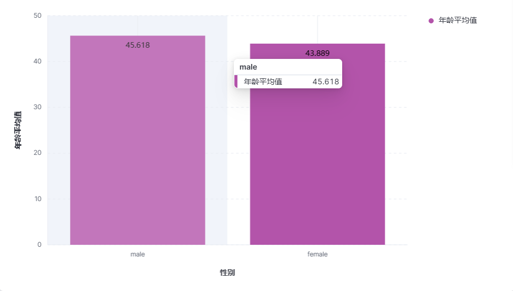

# 《实验五 Kibana 操作》

> **学院：省级示范性软件学院**
>
> **课程：高级数据库技术与应用**
>
> **题目：《实验五: Kibana 操作练习》**
>
> **姓名：龚鹏涛** 
>
> **学号：2100940082** 
>
> **班级：软工2202** 
>
> **日期：2024-11-20** 
>
> **实验环境：elasticsearch-8.12.2   kibana-8.12.2 ** 

## 一、实验目的

通过本次实验了解Kibana的基本操作并通过它对存储在 Elasticsearch 中的数据进行可视化分析。

## 二、实验内容

#### 1、配置kibana

在使用 Kibana 之前，需要确保 Elasticsearch 已经安装并运行。Kibana 需要连接到一个正在运行的 Elasticsearch 实例。可以通过修改 Kibana 的配置文件 kibana.yml 来指定 Elasticsearch 的地址：（按照雀语第六章1.3进行配置）

```
i18n.locale: "zh-CN"
elasticsearch.hosts: ["http://localhost:9200"]
xpack.encryptedSavedObjects.encryptionKey: 93afe88b7ea1e0014b1499530a7a9103
xpack.reporting.encryptionKey: eff06a6e0db99b7fa5567a79fe776bee
xpack.security.encryptionKey: f0e8568bfaeb9aef848774a7f69d007f
```


生成key，并将Elasticsearch和kibana运行。


#### 2、使用Kibana完成实验三 聚合操作的 10道题

##### 2.1统计每个产品类别的总销售额。


##### 2.2 计算每个城市的平均订单金额。


##### 2.3 找出销量最高的前5个产品。


##### 2.4 计算男性和女性客户的平均年龄。



##### 2.5 统计每种支付方式的使用次数和总金额。


##### 2.6 计算每月的总销售额。


##### 2.7 找出平均订单金额最高的前3个客户。


##### 2.8 计算每个年龄段（18-30，31-50，51+）的客户数量。


##### 2.9 计算每个产品类别的平均单价。


##### 2.10 找出订单数量最多的前5个城市


#### 3、将做好的10个可视化放到1个或2个仪表盘中，仪表盘中增加一些控件，文字描述，筛选等

**第一个仪表盘：**


**第二个仪表盘:**


第二个仪表盘相较于第一个仪表盘而言，我使用了一些不同的表达形式，例如：饼状图、词云等，内容显得更为丰富，更为的直观表达数据所要表达的信息，部分不同的题目用了不同方式去表达让数据显得更为的直观。


## 三、问题及解决办法

#### 问题

问题一：对于 1.5 统计每种支付方式的使用次数和总金额这个题目，在一个图层中无法很好的展示次数和总金额

问题二：对于kibana操作还不够熟练，时常会出现操作失误

#### 解决办法

对于问题一，我建立了两个图层并将第二个图层的垂直轴给调用到右边，使得两个图层能够很好的叠加在一起客观的展示其中相关性。

对于问题二，对一些操作我进行了一个网上查阅资料并练习，目前已经较为熟练，然后自主的去联系第二遍得到一个新的仪表板，让数据会说话，表达更为直观。
