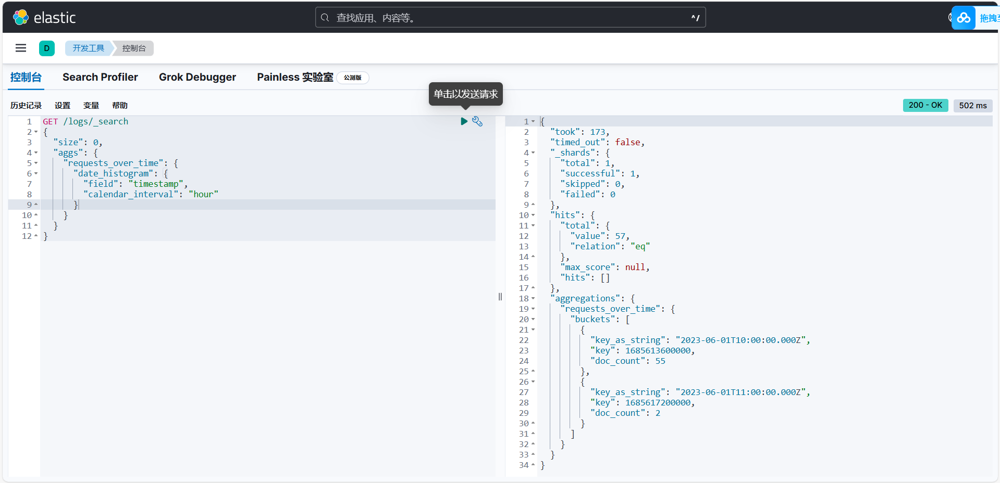

# 《实验四：Logstash操作》

> **学院：省级示范性软件学院**
>
> **课程：高级数据库技术与应用**
>
> **题目：《实验四：Logstash操作》**
>
> **姓名：龚鹏涛**
>
> **学号：2100940082**
>
> **班级：软工2202**
>
> **日期：2024-10-21**
>
> **实验环境：Elasticsearch8.12.2、 Kibana8.12.2、Logstash8.12.2**

## 1. 实验目的

- 使用 Logstash数据收集与整合

- 使用 Logstash数据间转换

## 2. 实验内容

### 2.1 logstash安装及环境配置

#### 2.1.1 安装

- windows的logstash 8.12.2下载链接：https://artifacts.elastic.co/downloads/logstash/logstash-8.12.2-windows-x86_64.zip

#### 2.1.2 环境配置及启动

- 进入logstash安装目录下的config文件夹C:\Users\hp\高级数据库使用工具\logstash-8.12.2\config，创建logstash.conf配置文件，包含以下内容：

  
  
  
  
- 进入C:\Users\hp\logstash\logstash-8.12.2\logstash.exe 执行下面运行 Logstash 的命令:

``` jsx
bin\logstash -f C:\Users\hp\logstash\logstash-8.12.2\config\logstash.conf
```


### 2.2 tomcat日志处理

**数据来源：**雀语上下载的tomcat_logs.zip

**要求：**

- 将tomcat的logs中的localhost_access_log访问日志导入到本地的elasticsearch中。
- 数据导入到一个名为tomcat_logs的索引。
- 在elasticsearch中做5个日志相关的分析，题目自拟。（提示：可以参考第04章聚合操作日志实战内容）

#### 2.2.1 编写配置文件

- 进入logstash安装目录下的config文件夹D:\elasticsearch-8.12.2-windows-x86_64\elasticsearch-8.12.2\config，创建Logstash.conf配置文件，包含以下内容：

  
  
  `path`: 指向 Tomcat 日志文件。
  
  `grok` 插件：解析日志的正则表达式（此处使用了 `COMMONAPACHELOG`，适用于标准 Apache 日志格式）。
  
  `date`: 将日志中的时间戳格式化为 Elasticsearch 的时间字段。
  
  `output`: 指定将数据导入到本地的 `Elasticsearch`。

#### 2.2.2 运行命令

- 进入 D:\elasticsearch-8.12.2-windows-x86_64\elasticsearch-8.12.2 执行下面的命令：

  ```jsx
  bin\logstash.bat -f D:\Dev\logstash-8.12.2-windows-x86_64\logstash-8.12.2\config\logstash.conf
  ```

- 成功运行截图：

  

#### 2.2.3 验证：在elasticsearch中查询tomcat_logs索引

- 在开发工具-Elastic中查询：

- 

  

#### 2.2.4 在elasticsearch中做5个日志相关的分析，题目自拟。

1. 总体请求统计：查询总请求数、平均响应时间和前10个最常见的状态码。

   - 代码以及运行结果：

   
   
2. 查询每小时的请求数

   - 代码以及运行结果：

   
   
   
   
3. 查询显示top 10的错误状态码

   - 代码以及运行结果：

   
   
   
   
4. 响应时间的百分位数据和前10个最慢的请求详情

   - 代码以及运行结果：

   
   
   
   
5. 查询每天的请求数、状态码分布、平均响应时间,以及响应时间的移动平均线。

   - 代码以及运行结果：

   
   
   
   
   

### 2.3 数据转换和传输

**要求：**

- 将本地的mysql数据库中的一张表导入到本地的elasticsearch中。

- 数据库表更新后，数据能够自动同步到elasticsearch中。

#### 2.3.1 编写配置文件

- 进入logstash安装目录下的config文件夹D:\Dev\logstash-8.12.2-windows-x86_64\logstash-8.12.2\config，创建JDBC.conf配置文件，配置文件内容如下图：


#### 2.3.2 运行命令

- 进入 D:\Dev\logstash-8.12.2-windows-x86_64\logstash-8.12.2执行下面的命令：

  
  
- 成功运行：

  

#### 2.3.3 验证：在elasticsearch中查询students索引


## 3. 问题及解决办法

**问题一**：在配置Logstash.conf时，会报一些错误，提示我meavn文件中xml配置文件有问题，以及我的jdk路径有问题：

**解决方法**：重新下载并配置我的jdk环境，忽视meavn文件的影响（因为我在后面实验发现两者并没有冲突，我也查阅了相关资料，显示我的jdk问题，所以忽视）